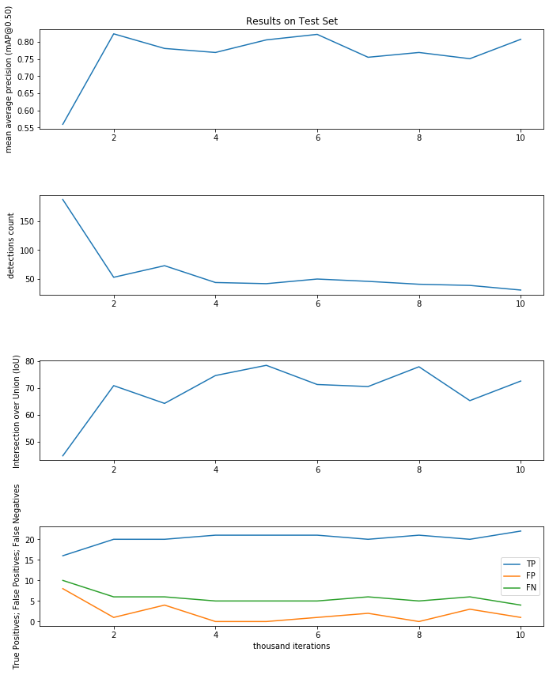
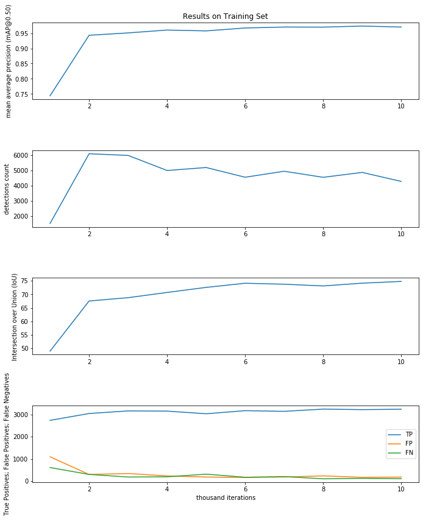

# Detecção de drones em imagens, vídeos ou diretamente da webcam
Drone detection using Haar Cascades, Yolov3 in images, videos and webcam. 

Projeto desenvolvido para exercitar técnicas de visão computacional, utilizando classificadores treinados em bases de dados não convencionais.  

O projeto utiliza a biblioteca OpenCV e classificadores Haar Cascades e Yolov3 personalizados para a detecção de drones em imagens, vídeos ou diretamente da webcam. 

### Instalação

*A instalação foi feita em Windows10. Não garanto o funcionamento correto em outros sistemas.

Instale o [Anaconda](https://docs.anaconda.com/anaconda/install/). 
Baixe e extraia o repositório do projeto. 
Com o Anaconda Prompt aberto, navegue até a pasta do repositório. 
Exemplo: 
> cd E:\Documents\GitHub\yolo-classifier

Para a criação e ativação do ambiente "cvdrone":
> conda env create --file environment.yml
> conda activate cvdrone

### Utilização
Para rodar os arquivos python, abra o Anaconda Prompt na pasta do repositório e ative o ambiente "cvdrone". 

Os argumentos principais dos comandos a seguir são: 
 * -i caminho para o arquivo de entrada
 * -o pasta para o arquivo de saída (será salvo com o mesmo nome do arquivo original)
 * -y pasta contendo os arquivos do Yolov3

Haar Cascades para detecção de rostos e drones com webcam. 
> python cascades_webcam.py

Yolov3 em imagens. Exemplo:
> python YOLO_final.py -i data/100.JPEG -o output -y yolo-custom
	
Yolov3 em vídeos:
> python YOLO_final.py -i data/hubsan.mp4 -o output -y yolo-custom

Yolov3 com webcam:
> python YOLO_webcam.py -o output -y yolo-custom

### Desenvolvimento

Drones ou quadricópteros foram a escolha do objeto de detecção pois eu possuo um drone e eu posso testar a eficácia da detecção com meus próprios vídeos, além de poder utilizar o sistema para projetos futuros. 

Primeiramente foi criado um classificador utilizando Haar Cascades. Para o treinamento, utilizou-se algumas imagens de drones sem direitos autorais, e milhares de imagens de paisagens retiradas do [ImageNet](https://image-net.org/).

A classificação usando Haar Cascades é bastante simples de ser implementada.

Depois, uma rede do Yolov3 foi treinada utilizando esta [base de dados](http://dx.doi.org/10.17632/zcsj2g2m4c.4) contendo 2864 imagens de drones e suas respectivas posições rotuladas. Depois de 10,000 iterações, os resultados foram avaliados tanto no conjunto de treino quanto em um conjunto de 24 imagens de teste pertencentes à base de dados, mas que foram rotuladas manualmente. 

Para decidir qual conjunto de pesos utilizar, foram gerados os seguintes gráficos:

A classificação utilizando o Yolov3 foi feita com base em um [projeto anterior próprio](https://github.com/brusangues/UFABC-Digital-Image-Processing-2019.3-Project-Car-Plate-Segmentation-and-OCR).

### Referências Principais

Face Detection: 
https://www.superdatascience.com/pages/computer-vision

Creating your own Haar Cascade OpenCV Python Tutorial: 
https://pythonprogramming.net/haar-cascade-object-detection-python-opencv-tutorial/

ImageNet: 
https://image-net.org/

YOLO: Real-Time Object Detection: 
https://pjreddie.com/darknet/yolo/

YOLO object detection with OpenCV: 
https://www.pyimagesearch.com/2018/11/12/yolo-object-detection-with-opencv/

Train YOLO to detect a custom object (online with free GPU): 
https://pysource.com/2020/04/02/train-yolo-to-detect-a-custom-object-online-with-free-gpu/

How to train YOLOv3 using Darknet on Colab 12GB-RAM GPU notebook and speed up load times: 
http://blog.ibanyez.info/blogs/coding/20190410-run-a-google-colab-notebook-to-train-yolov3-using-darknet-in/

Aksoy, Mehmet Çağrı; Orak, Alp Sezer; Özkan, Hasan Mertcan; Selimoğlu, Bilgin (2019), “Drone Dataset: Amateur Unmanned Air Vehicle Detection”, Mendeley Data, v4. 
http://dx.doi.org/10.17632/zcsj2g2m4c.4
